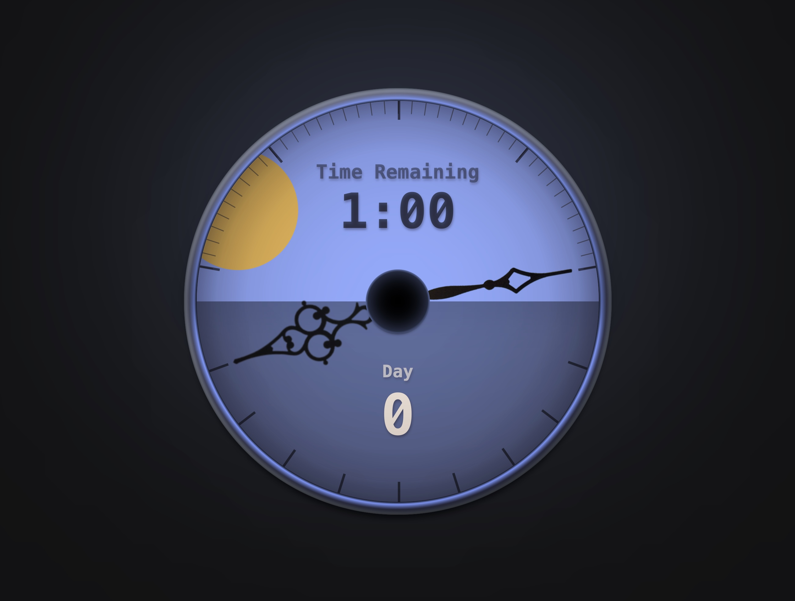

# BOTCT Clock

A simple app for tracking time during a blood on the clocktower game, with a nice satisfying "bong" sound. 


#### Features
- Timer countown & Day tracker
- Supports multiple clients all operating synchronously
- Multiple pre-configured timer options
- Anytime "bong" button

#### Screenshot



## Running the app
Either:
- (Recommended) run with Docker:
    > Requires Docker
    ```sh
    docker compose up
    ```
- Or run with NodeJS:
    > Requires NodeJS v24.5.0 or higher

    ```sh
    npm install
    npm run build
    node build
    ```

Then, open a browser and navigate to:
- `http://<host>:3000` for the client
- `http://<host>:3000/admin` for admin controls
- `http://<host>:3000/debug` for debug info
(where `<host>` is the address of the host machine, either IP address (e.g. 192.168.0.64), or hostname. On the same machine, you can use "localhost" (e.g. http://localhost:3000/admin))


### Changing the port
- <b>Docker</b>: Edit "docker-compose.yml" and update the following lines:
    ```yaml
        ...
        ports:
            - "<PORT>:3000"
        ...
    ```
    Then run again.
- <b>NodeJS</b>: Run `PORT=<PORT> node build`


(where `<PORT>` is your desired port)

## Developing

> Requires NodeJS v24.5.0 or higher

Once you've created a project and installed dependencies with `npm install` (or `pnpm install` or `yarn`), start a development server:

```sh
npm install
npm run dev -- --host --open
```

(Note: --host will serve on all interfaces so that you can access the webpage from other devices)<br>
(Note: --open will automatically open the root page in your browser)

## Building
> Requires NodeJS v24.5.0 or higher

To create a production version of your app:

```sh
npm run build
```

You can preview the production build with `npm run preview`.
